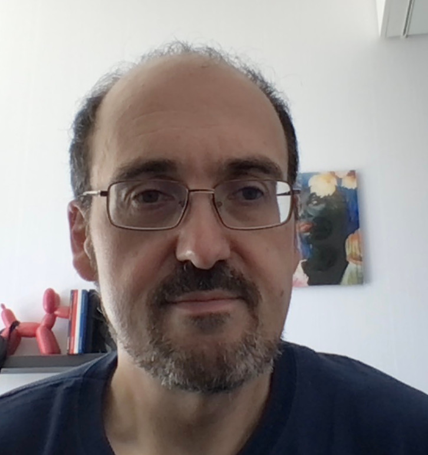

Hi 

I'm Richard; I'm the CTO at [Zilliqa](https://zilliqa.com) and Director of Studies in Computer Science at [Selwyn College, Cambridge](https://www.sel.cam.ac.uk).

Previously, I've worked on payment systems as CTO at
[BigPay](https://www.bigpayme.com), on embedded systems for road
vehicles, drones, and consumer electronics as (variously) founder,
CEO, and CTO at [Kynesim](https://www.kynesim.co.uk), and before that
I wrote software (actual work!) for video codecs, chip synthesis and
web apps at various startups.

I hold an MA and PhD in Computer Science from Cambridge.

I'm also an external member of the [Faculty board of
Computer Science and
Technology](https://www.cst.cam.ac.uk/local/committees/faculty-board).

I have very little time for research, but when I do, it's mostly
processor architecture (because I used to write ARM2 assembler video
games), distributed systems (from BigPay and Zilliqa), and a bit of
machine learning (from my PhD).

In my spare time, I fly light aircraft, grow things and occasionally
play guitar.

Here are some links to:

 * My (sadly thin!) [personal github](https://github.com/rrw1000) - where you can find, among other things, [the source for this blog](https://github.com/rrw1000/blog).
 * My  [LinkedIn profile](https://www.linkedin.com/in/rrw1000).
 * If you're a CST student at Selwyn, Emmanuel or Clare and have somehow ended up here (hi, google!) here's a link to the [supervision wiki](https://sup.rrw.me.uk) (note that you need a Raven id to log in).
